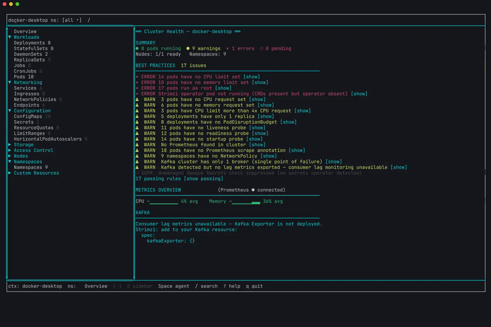

<div align="center">

```
██████╗   █████╗  ██████╗
██╔══██╗ ██╔══██╗ ██╔══██╗
██████╔╝ ╚██████║ ██████╔╝
██╔═══╝   ╚═══██║ ██╔══██╗
██║       █████╔╝ ██║  ██║
╚═╝       ╚════╝  ╚═╝  ╚═╝
```

**P R I V A T E E R** · *the agentic Kubernetes TUI*

[](https://github.com/stefanrusek/privateer/actions/workflows/ci.yml)
[](https://github.com/stefanrusek/privateer/releases/latest)

A single-binary Kubernetes terminal UI with a fully local LLM agent —
ask your cluster questions in plain language, nothing leaves your machine.



</div>

---

## Features

- **Live everything** — watch-stream driven resource tables, badges, and a
  cluster health dashboard that lands you on what's wrong first.
- **A local agent in the command bar** — press `Space` and type
  `crashing pods` or `why is order-api failing?`. Instant deterministic
  navigation for common phrases; a local ONNX model (Gemma 3n E2B or
  Qwen3 0.6B — your choice on first run) answers diagnostic questions.
  No API keys, no network calls, ever.
- **Best-practices engine** — 35 rules (resources, reliability, security,
  networking, storage, Kafka, observability) evaluated live against the
  cluster, with rule suppression via annotations.
- **Metrics that degrade gracefully** — Prometheus (auto-discovered
  in-cluster and reached through a managed port-forward tunnel) gives full
  ASCII time-series charts; plain metrics-server gives session sparklines;
  neither installed simply hides the columns.
- **First-class Kafka** — Strimzi CRD detection, broker/topic views,
  consumer-lag charts, and Kafka-specific health rules.
- **The actions you actually use** — log tailing (search, timestamps,
  previous instance, download), `exec` into containers with a real PTY,
  managed port-forwards with a quit guard, delete with confirm, and a full
  YAML editor with diff-before-apply.
- **Region-focus navigation** — `Tab`/`Shift+Tab` cycle focus between the
  sidebar, list, and detail regions (the focused region draws a double-line
  accent border); arrows move *within* the focused region. Drag a border to
  resize the split, or `+`/`-` (`Alt+↑/↓`) to nudge it.
- **A real YAML editor** — `e` opens an in-pane editor with diff-before-apply;
  `Ctrl+E` pops the buffer out to `$EDITOR` and folds your edits back in.
- **Inline Logs controls** — the Logs tab carries dropdown buttons for the
  container (`o`) and line limit (`l`) plus toggles for timestamps, wrap, and
  live-tail pause, so you stay on the keyboard.
- **Mouse + keyboard** — click rows, tabs, the sidebar, and dropdown buttons;
  scroll the region under the cursor with the wheel; or never leave the home
  row (vim-style keys throughout).
- **One binary** — `bun build --compile` output with the ONNX runtime
  embedded. Layout, the list/detail split, collapsed sidebar sections, your
  per-kind tab choices, and per-context selections persist between runs.

## Install

Requires `kubectl` on your PATH and a kubeconfig pointing at a cluster.

**Download a release** ([latest](https://github.com/stefanrusek/privateer/releases/latest)):

```sh
# macOS (Apple Silicon)
curl -fsSL https://github.com/stefanrusek/privateer/releases/latest/download/p9r-darwin-arm64.tar.gz | tar xz
sudo mv p9r-darwin-arm64 /usr/local/bin/p9r

# Linux x64 (arm64: substitute p9r-linux-arm64)
curl -fsSL https://github.com/stefanrusek/privateer/releases/latest/download/p9r-linux-x64.tar.gz | tar xz
sudo mv p9r-linux-x64 /usr/local/bin/p9r
```

Windows x64 is published as `p9r-windows-x64.zip` (experimental).

**Or build from source** (requires bun >= 1.3):

```sh
git clone https://github.com/stefanrusek/privateer && cd privateer
bun install
bun run build          # single binary for this machine → dist/p9r
bun run build:all      # cross-compile every supported platform
```

Or run straight from the checkout during development: `bun run start`.

On first launch p9r asks which agent model to use — **Gemma 3n E2B**
(best answers, ~3GB) or **Qwen3 0.6B** (small and fast, ~550MB) — and
downloads it once to `~/.config/p9r/models/`. Pick **No agent** to skip
the download entirely; navigation and `!commands` still work.

## Quick start

- Press `Space` to ask the agent anything (`crashing pods`,
  `how many pods are running?`); `!` switches the command bar to commands
  (`!ns demo`, `!ctx docker-desktop`, `!q`).
- `Tab`/`Shift+Tab` move focus between the sidebar, list, and detail regions;
  arrows navigate *within* the focused region.
- `Enter` opens the detail pane (Overview · YAML · Events · Logs · Metrics ·
  Agent); on a pod, `l`/`x`/`p`/`d` are logs / exec / port-forward / delete.
- `?` opens the full, grouped keybinding reference (the same keymap shown
  below).

The complete keymap follows. **This table is generated from the in-app keymap
registry (`src/ui/keymap.ts`) and verified byte-for-byte by a unit test** — the
`?` help overlay and these docs can never drift. Do not hand-edit between the
markers; regenerate from `renderKeymapMarkdown()`.

<!-- KEYMAP:START -->

### Global

| Key | Action |
| --- | --- |
| `Tab / Shift+Tab` | Cycle focus between regions |
| `q` | Quit |
| `Ctrl+C` | Quit (any mode) |
| `Esc` | Close the detail pane / cancel input |
| `?` | Toggle this help overlay |
| `n` | Open the namespace picker |
| `Space` | Focus the command bar (agent input) |
| `!` | Focus the command bar (command input) |
| `c` | Open the context switcher |
| `r` | Refresh the resource list (or retry a failed switch) |
| `F` | Port-forward manager |
| `+ / -  (Alt+↑/↓)` | Resize the list/detail split |
| `wheel` | Scroll the region under the cursor |
| `drag border` | Drag a border line to resize |
| `click` | Focus / select under the cursor |

### Sidebar

| Key | Action |
| --- | --- |
| `↑ / ↓  (k / j)` | Move up / down |
| `←` | Collapse category / go to parent |
| `→ / Enter` | Expand category / select resource |
| `h` | Collapse all categories |
| `l` | Expand all categories |
| `/` | Search the resource list |

### List

| Key | Action |
| --- | --- |
| `↑ / ↓  (k / j)` | Move selection up / down |
| `/` | Search the resource list |
| `← / →` | Scroll columns horizontally |
| `g g` | Jump to top |
| `G` | Jump to bottom |
| `Ctrl+F / Ctrl+B` | Page down / up |
| `Enter` | Open the detail pane |
| `e` | Open the YAML editor |
| `y` | Copy resource name to clipboard |
| `d` | Delete the resource (confirm) |
| `l` | View logs (pods) |
| `x` | Exec a shell (pods) |
| `p` | Port-forward (pods) |

### Detail (all tabs)

| Key | Action |
| --- | --- |
| `← / →` | Previous / next tab |
| `↑ / ↓` | Scroll the tab content |
| `PageUp / PageDown` | Page up / down |
| `g / G` | Top / bottom |
| `1 – 6` | Jump to a tab |
| `Esc` | Close the detail pane |

### Detail · Logs

| Key | Action |
| --- | --- |
| `↑ / ↓` | Scroll (pauses live tail off the bottom) |
| `PageUp / PageDown` | Page up / down |
| `g / G` | Top / bottom |
| `/` | Search the logs |
| `n / N` | Next / previous search match |
| `o` | Container dropdown |
| `l` | Line-limit dropdown |
| `p` | Pause / resume live tail |
| `t` | Toggle timestamps |
| `w` | Toggle wrap |
| `P` | Previous-instance logs |
| `d` | Download the logs |

### Detail · YAML

| Key | Action |
| --- | --- |
| `e` | Edit the YAML |
| `v` | Reveal (Secrets) |
| `m` | Toggle managedFields visibility |
| `Ctrl+S` | Save — review the diff (editing) |
| `Ctrl+E` | Open in $EDITOR (editing) |
| `Esc` | Cancel the edit (editing) |

### Detail · Metrics

| Key | Action |
| --- | --- |
| `[ / ]` | Change the time range |

### Detail · Events

| Key | Action |
| --- | --- |
| `f` | Toggle the Warning / All events filter |

### Command bar

| Key | Action |
| --- | --- |
| `type` | Enter a command / agent prompt |
| `Enter` | Run |
| `Esc` | Cancel |

### Overlays (switcher / pickers / dropdowns)

| Key | Action |
| --- | --- |
| `↑ / ↓  (k / j)` | Move the highlight |
| `Enter` | Select |
| `Esc` | Close |
| `type` | Filter (where filterable) |

<!-- KEYMAP:END -->

## Configuration

`~/.config/p9r/config.yaml` (hot-reloaded while running):

```yaml
agent:
  model: onnx-community/gemma-3n-E2B-it-ONNX   # or any transformers.js ONNX id
  timeoutSeconds: 15                            # raise on slower machines
  # enabled: false                              # turn the agent off

prometheus:
  url: http://localhost:9090                    # skip auto-discovery
```

Choosing a model by machine: Gemma 3n E2B is the default and the right
pick at 16GB+ of RAM. On small machines (8GB laptops) choose Qwen3 0.6B —
it runs on the GPU via WebGPU and answers in well under a minute, while
Gemma on constrained hardware can take several minutes per answer. The
agent's tool-calling enables itself automatically when the measured model
speed fits your timeout budget.

## Test cluster fixtures

A reproducible playground (used by p9r's own verification):

```sh
bun run fixtures:up          # demo workloads + metrics-server + Prometheus
bun run fixtures:up kafka    # + single-node Strimzi Kafka (needs ~4GB Docker VM)
bun run fixtures:down
```

This gives you healthy deployments, a CrashLoopBackOff pod for the health
rules to find, Prometheus + kube-state-metrics scraping the exporters the
charts use, and (opt-in) a KRaft Kafka with a topic and kafka-exporter.

## Troubleshooting

p9r journals warnings and errors (watch-stream drops, agent failures) to
`~/.config/p9r/debug.log` as JSON lines — check there first when something
misbehaves. Set `P9R_DEBUG=1` for verbose tracing (stream events, agent
rounds, tool calls, model timing). Pretty-print with
`npx pino-pretty < ~/.config/p9r/debug.log`. The file self-truncates at 5MB.

## Development

```sh
bun run gate          # format check · lint · grep-gate · typecheck ·
                      # unit tests (100% coverage enforced) · BDD
bun run test:envtest  # integration tests against a real kube-apiserver
```

The architecture is spec-driven: see `specs/001-initial-features/` for the eight specification
documents this implementation follows, including the quality bar
(spec 08: 100% line/branch/function/statement coverage on all
non-adapter code, no coverage exemptions).

## License

TBD.
