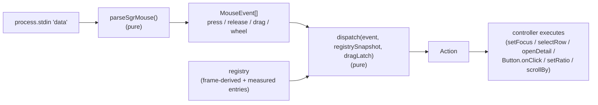

# Chunk 04 — Mouse: registry, components, dispatch

**Status:** DRAFT
**Depends on:** 02 (`computeFrame` region `Rect`s + handle `Segment`s), 03
(detail `scrollBy` entry point + Logs pause/resume coupling), 01 (`app.focus`
region model + `setFocus`)
**Implements / amends:** `spec/spec-02-navigation-layout.md` (mouse). Update it
where this changes behavior.

> **This chunk replaces p9r's entire mouse stack**, not just the geometry. The
> old plan (a pure `hit-test.ts` mapping absolute terminal coordinates to
> regions) is superseded by a **hit-region registry**: interactive things
> register their rect with a single dispatcher, and one SGR stream feeds every
> mouse gesture (click, drag, wheel) through it. ink-mouse is removed.

## Why (decisions baked in)

Today there are **two** mouse code paths fighting each other (LiveApp.tsx
`MouseRouter`, ~23): ink-mouse parses `click`/`scroll`, while drag/release are
parsed straight off `process.stdin` because ink-mouse's drag event is broken
(see CLAUDE.md). ink-mouse also force-enables any-motion tracking (1003h), which
we immediately undo. Click dispatch is then a wall of hard-coded arithmetic in
`controller.ts` (`handleMouseClick` ~2739, `handleMouseScroll` ~2896,
`handleMouseDrag` ~2870, `clickDetailTabBar` ~2829) that assumes `contentTop=2`,
derives row indices from `verticalRatio`, and — post-chunk-02 borders — is now
wrong as well as duplicated. Wheel checks only `x`, so it scrolls the list even
when the cursor is over the detail pane (a reported bug). The `✕` close button
is drawn but not clickable.

The chosen design (agreed with the user):

1. **One dispatcher over one SGR stream.** A single `process.stdin` listener
   parses *all* SGR mouse reports (press / release / motion-drag / wheel). No
   ink-mouse, no second parser, no 1003h tug-of-war.
2. **A hit-region registry.** Every interactive thing registers a rect plus a
   press/wheel handler. The dispatcher finds the **topmost** registered entry
   containing the point and delegates. This kills the per-widget coordinate
   math.
3. **Three components, layered.**
   - `<Button>` — a discrete, **non-nestable leaf** widget (tabs, `✕`, header
     chips, picker items, YAML save/cancel). It **measures its own rendered
     rect** (Yoga) and registers it; clicking it fires `onClick`. Measuring —
     not recomputing geometry — is the whole point: no fragile x-range math.
   - `<FocusableRegion>` — the root-level focusable layout container (header,
     detail, command bar). Its rect comes from `computeFrame` (chunk 02) as a
     prop; clicking it focuses the region (drives chunk 01's `app.focus`); the
     wheel over it scrolls it.
   - `<SelectableList>` — composes `FocusableRegion` and adds a row model
     (sidebar + resource list). It maps a local click `y` to a row index
     (`rowInContent + scrollOffset`) **itself**, so per-row geometry is local
     and survives layout changes. Rows are **not** Buttons (a 200-row list must
     not churn 200 registry entries per render).
4. **Uniform dispatch contract.** Every registered entry exposes `{ rect,
   layer, handlePress(localX, localY), handleWheel?(dir) }`. The dispatcher's
   only job is "find topmost entry at (x,y), translate to local coords,
   delegate." Buttons fire `onClick`; lists select/open a row; bare regions
   focus; handles begin a drag. No `if (isList)`/`if (isButton)` in the router.

## Event flow



The decision is **pure and fully tested**; the controller only executes the
returned `Action`.

## Pure modules (`src/ui/mouse/**`, 100% covered)

- **`sgr.ts`** — `parseSgrMouse(chunk: string): MouseEvent[]`. Decodes SGR
  reports `\e[<b;x;yM` (press/motion) and `\e[<b;x;ym` (release):
  - button number from `b & 0b11`; **motion/drag** flag `b & 0x20`; **wheel**
    `b & 0x40` (low bits: `64`=up, `65`=down); modifiers `shift 4`, `meta 8`,
    `ctrl 16`.
  - emits `{ type: 'press'|'release'|'drag'|'wheel', x, y, button, dir?, mods }`
    with **0-based** coordinates (terminal reports 1-based).
  - tolerant of multiple reports in one chunk and of interleaved non-mouse
    bytes. This subsumes both today's regexes (the ink-mouse press/scroll path
    **and** the hand-rolled `\[<32;…M` drag regex).
- **`registry.ts`** — the entry model and matchers:
  - `Entry = { id, rect: Rect, layer: number, kind: 'region'|'list'|'button'|'handle', ... }`.
  - `topmostAt(entries, x, y): Entry | null` — highest `layer` whose `rect`
    contains the point; ties broken by most-recent registration. (Layers let
    overlays/pickers sit above base regions — see "Overlays".)
  - `toLocal(entry, x, y): { localX, localY }`.
  - a small immutable register/unregister/snapshot surface used by the
    components and controller.
- **`dispatch.ts`** — `dispatch(event, snapshot, dragLatch): Action`, the single
  routing decision:
  ```
  Action =
    | { kind: 'focusRegion'; region }
    | { kind: 'selectRow'; region; index }       // first click on a row
    | { kind: 'openDetailRow'; region; index }   // click on the selected row
    | { kind: 'buttonPress'; id }
    | { kind: 'beginDrag'; handle: 'sidebar' | 'vertical' }
    | { kind: 'dragTo'; handle; ratio }          // ratio already clamped
    | { kind: 'endDrag'; handle }
    | { kind: 'wheel'; region; dir }
    | { kind: 'none' }
  ```
  - **Drag latch:** once a `press` lands on a `handle`, the latch records it;
    subsequent `drag` events route to that handle **regardless of where the
    cursor wanders** (the "no slip" requirement) until `release`. Latch state is
    passed in and updated by the controller; the *decision* is pure.
  - Wheel resolves to the topmost **region** (Buttons/handles don't take
    wheel).
- **`ratios.ts`** (or co-located) — `sidebarRatioFromX(frame, x)` clamped to
  `[MIN, MAX]`; `verticalRatioFromY(frame, y)` clamped to `[0.2, 0.8]`. Pure.
- **`measure.ts`** — `absoluteRect(node): Rect`, walking a Yoga node's parent
  chain summing `getComputedLeft()/getComputedTop()` (+ own width/height). Takes
  an abstract `{ left, top, width, height, parent }` node so it is unit-tested
  with a **fake** tree — no real Yoga needed in tests. This is the only piece of
  geometry the framework computes for us; everything else is frame-derived.

## Adapter wiring (`src/adapters/live/**`, excluded — thin glue, BDD-exercised)

- **`mouse-router.ts`** — one `process.stdin.on('data', …)` listener →
  `parseSgrMouse` → `dispatch` → execute each `Action` on the controller.
  Owns the **mouse-mode lifecycle**: enable `1000h` (click) + `1002h`
  (button-held motion) + `1006h` (SGR) on start; **hard-disable all mouse modes
  on quit / suspend (exec handover) / process exit** so escape sequences never
  leak into the user's shell (CLAUDE.md gotcha — this is already our
  responsibility today, just consolidated). `1003h` (any-motion) stays **off**.
  Removes `MouseProvider`/`useMouse` and the `@zenobius/ink-mouse` dependency
  (drop it from `package.json` + lockfile).
- **`Button.tsx` / `FocusableRegion.tsx` / `SelectableList.tsx`** — thin React
  wrappers: refs + `useEffect` that register/unregister entries and (for
  `Button`) call `measure.ts` against `ref.current.yogaNode` on mount/layout.
  All *decisions* live in the pure modules above; these only wire refs, effects,
  and callbacks. They render their children (Button adds no chrome; the bordered
  grid is still drawn by chunk 02's frame renderer).
- **Registry instance** — owned by the controller. The controller registers the
  **frame-derived** entries (the five region rects and the two handle segments)
  whenever `computeFrame` changes; components register the **measured** Button
  entries and the list/region entries on mount.

### Coverage note

Today mouse decoding is split between an **uncovered** dependency (ink-mouse) and
the adapter. After this chunk, *all* parsing and routing decisions are in pure
`src/ui/mouse/**` under the 100/100/100/100 bar; only ref-touching wiring and the
stdin/mode lifecycle remain in `src/adapters/**`.

## Components in detail

### `<Button onClick label? id>`
- Leaf only. **Buttons must not contain Buttons** — the design forbids nesting
  (overlapping equal-layer rects make "topmost" ambiguous). Honor this in the
  component tree; on a detected nested Button, log to `~/.config/p9r/debug.log`
  (never stdout/stderr) and treat the inner one as authoritative.
- Measures its rendered rect and registers `{ kind:'button', rect, layer,
  handlePress: () => onClick() }`. Re-measures on terminal resize / content
  change; unregisters on unmount.
- **Adopters this chunk:** detail **tab labels**, the detail **`✕`** close
  button, the header **context** / **namespace** / **search** chips. (Chunk 06's
  inline Logs-container picker items and chunk 07's YAML **Save/Cancel** become
  Buttons in those chunks — "for free" once this exists.)

### `<FocusableRegion regionId rect focused onWheel>`
- Receives its `rect` from `computeFrame` (no measuring). Registers
  `{ kind:'region', rect, layer:0, handlePress: () => setFocus(regionId),
  handleWheel: onWheel }`.
- Consumes chunk 01's focus model: `focused` drives chunk 02's highlight;
  clicking it calls `setFocus(regionId)`. Keyboard `Tab` focus (chunk 01) and
  mouse focus therefore share the single `app.focus` source — no parallel focus
  notion.
- Used directly by **header**, **detail**, **command bar**.

### `<SelectableList regionId rect focused rows scrollOffset selectedIndex …>`
- Composes `FocusableRegion`; overrides `handlePress(localX, localY)` to map
  `index = localY + scrollOffset` (no magic `−1`/`−2`; the rect is already the
  inner content area). `localY` outside the row band → focus only.
- Click semantics: first click on a row → `selectRow`; click on the
  **already-selected** row → `openDetailRow` (opens + focuses detail, per chunk
  01). Matches today's "second click opens" behavior.
- Instances: the **sidebar** tree and the **resource list**.

## Behaviors (all via the dispatcher)

### Wheel routes by cursor position (the bug fix)
`dispatch` resolves the wheel to the topmost **region** under the cursor and
returns `{ kind:'wheel', region, dir }`, independent of `app.focus`:
- **sidebar** → move sidebar cursor; **list** → scroll/move list selection;
  **detail** → `scrollBy(±WHEEL_LINES)` (proposed 3) via chunk 03, including
  Logs pause/resume; **header / commandBar / handles / none** → ignored.

### Drag-resize on the visible border handles
The two shared border lines (chunk 02 `handles.sidebar`, `handles.vertical`) are
registered as `handle` entries with a **±1-cell tolerance** so the thin lines are
easy to grab. On `press` → `beginDrag`; each `drag` → `dragTo` with the clamped
ratio (`sidebarRatioFromX` / `verticalRatioFromY`); on `release` → `endDrag` and
`saveLayout()`. The latch (above) prevents slipping off the line mid-drag.
Vertical resize only when detail is open. **Affordance:** a grabbed (and
optionally hovered) handle segment renders accent-highlighted (chunk 02's frame
already supports per-segment accent).

### Clicks
- **Context** Button → open context switcher; **namespace** Button → open
  namespace picker; **search** Button → `mode:'search'`.
- **Detail tab** Button → switch to that tab and focus detail.
- **`✕`** Button → close the detail pane (newly wired).
- **Region / row** (FocusableRegion / SelectableList) → focus, and for lists
  select/open per above.
- **Command bar** region → focus the agent input.

### Overlays & z-ordering
Modals/overlays (context switcher, namespace picker, help, confirm, and chunk
06's container picker) register their entries on a **higher layer** plus a
full-area backdrop entry on that layer, so (a) their Buttons/rows win
`topmostAt` over the base regions beneath, and (b) clicks outside the overlay
hit the backdrop (swallow / close per the overlay's own rules) rather than
leaking to the list underneath.

## Acceptance criteria (given-when-then)

```gherkin
Feature: One SGR stream, no ink-mouse

  Scenario: All gestures parse from a single stdin listener
    Given the TUI is running
    Then no code imports "@zenobius/ink-mouse"
    And press, drag, release, and wheel are all produced by parseSgrMouse

  Scenario: Mouse modes are torn down on exit
    Given the TUI has enabled mouse reporting
    When the app quits or suspends for an exec handover
    Then all mouse modes (1000/1002/1003/1006) are disabled
    And no escape sequences leak into the shell
```

```gherkin
Feature: Wheel routes by cursor position

  Scenario: Wheel over the detail pane scrolls the detail content
    Given the detail pane is open and the list is focused
    When I scroll the wheel with the cursor over the detail pane
    Then the detail content scrolls
    And the list selection does NOT move

  Scenario: Wheel over the list scrolls the list
    Given the detail pane is open and focused
    When I scroll the wheel with the cursor over the list
    Then the list scrolls
    And the detail content does NOT move
```

```gherkin
Feature: Drag-resize via border handles

  Scenario: Drag the sidebar border to resize horizontally
    When I press on the sidebar│right border line and drag right
    Then the sidebar widens
    And the new sidebarRatio is persisted on release

  Scenario: Drag the list/detail border to resize vertically
    Given the detail pane is open
    When I press on the list│detail border line and drag down
    Then the list grows and the detail shrinks
    And the new verticalRatio is persisted on release

  Scenario: A grabbed handle does not slip
    Given I have grabbed the list│detail border
    When my drag wanders a column left or right
    Then I am still resizing vertically until I release
```

```gherkin
Feature: Buttons dispatch clicks

  Scenario: Click a detail tab switches to it
    Given the detail pane is open
    When I click the "YAML" tab
    Then the YAML tab is active and the detail pane is focused

  Scenario: Click the close button closes the pane
    Given the detail pane is open
    When I click the ✕
    Then the detail pane closes

  Scenario: Click the context opens the switcher
    When I click the context chip in the header
    Then the context switcher opens

  Scenario: Click the namespace opens the picker
    When I click the namespace chip in the header
    Then the namespace picker opens

  Scenario: Buttons do not nest
    Then no Button is rendered inside another Button
```

```gherkin
Feature: Region and row clicks via the registry

  Scenario: Clicking a region focuses it
    Given the list is focused
    When I click inside the sidebar
    Then the sidebar is focused

  Scenario: Second click on the selected row opens detail
    Given a row is selected in the list
    When I click that same row again
    Then the detail pane opens and is focused

  Scenario: An open overlay captures clicks above the list
    Given the namespace picker is open over the list
    When I click a namespace entry in the picker
    Then that namespace is selected
    And the list row beneath the click is NOT selected
```

## Out of scope
- Frame geometry (chunk 02) and detail viewport math (chunk 03); this chunk
  consumes their rects/handles/`scrollBy`.
- The inline Logs-container picker (chunk 06) and YAML Save/Cancel (chunk 07)
  themselves — they merely *adopt* `<Button>` in their own chunks.

## Done when
- ink-mouse is gone; one stdin listener + pure `parseSgrMouse` produce every
  mouse gesture; mouse modes are hard-disabled on quit/suspend/exit.
- `src/ui/mouse/**` holds all parsing/registry/dispatch/ratio/measure logic,
  100% covered; `controller.ts` only executes returned `Action`s and holds the
  drag latch — no geometry arithmetic remains in the mouse handlers.
- Wheel scrolls the region under the cursor (detail included) regardless of
  focus; the two visible borders drag-resize with a latch and persist; clicking
  a tab/`✕`/context/namespace does the right thing; region/row clicks
  focus/select/open; overlays capture clicks above the base regions.
- `<Button>` (non-nestable), `<FocusableRegion>`, and `<SelectableList>` exist
  and are the only way mouse targets are registered.
- `bun run gate` is green.
