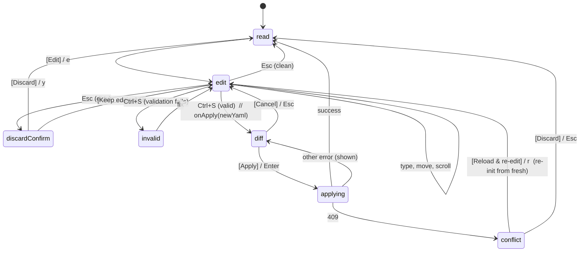

# Chunk 07 — YAML editor

**Status:** DRAFT
**Depends on:** 01 (detail keyboard/focus model + `yamlMode` arbitration), 02
(detail `Rect` width — no wrap/spill), 03 (read-mode scroll viewport), 04
(`<Button>` + accelerator convention for the action bars)
**Implements / amends:** `spec/spec-04-detail.md` §6 (YAML read/edit) and §7
(diff/apply). Update it where this changes behavior.

## User stories

> As a user, I want to edit a resource's YAML **in the pane** — a real
> multi-line editor that scrolls — or **pop out to `$EDITOR`** when I want my
> own editor, then come back.

> As a user, when I save I want to **review a diff and confirm** before anything
> touches the cluster, and I want **Cancel/Revert** to throw my pending edits
> away.

## What exists today

`src/ui/components/YamlTab.tsx` is a **self-contained, stateful island**:

- It owns `useState` (mode: `read | edit | discard-confirm | diff`, the
  `EditBufferHandle`, cursor) **and its own `useInput`**. When
  `yamlMode !== 'read'` the controller's detail handler **bails**
  (controller.ts:3528), so all editing keys go to the component.
- The pure pieces already exist: `src/yaml/edit-buffer.ts` (immutable buffer),
  `validate.ts`, `diff.ts`, `highlight.ts`, `redact.ts`.
- **`DiffView.tsx` calls the cluster directly** (`kubeClient.replace` /
  `kubeClient.get`) — a boundary call living inside a component.
- There is **no `$EDITOR` pop-out**, the editor body **doesn't scroll** (renders
  every line), and the action affordances (`[Edit]`, `[reveal]`, `[Apply]`,
  `[Cancel]`) are underlined `Text`, **not clickable**.

## Architecture (decision)

**Option B with a narrow component boundary.** The editor stays a self-contained
widget, but the **orchestration and the cluster boundary move to the
controller**. The contract between them is tiny:

```
<YamlEditor
  initialYaml: string
  focused: boolean
  width, height            // from chunk 02 detail Rect
  onApply: (newYaml: string) => void   // hand the controller a string; it does the rest
  onCancel: () => void
  onDirtyChange?: (dirty: boolean) => void
/>
```

- **The editor owns its transient editing state** — edit buffer, cursor, and its
  **own scroll offset** (cursor-following) — and handles editing keys via a
  **scoped `useInput`** that is active only while editing **and** focused. This
  is the accepted pattern for a focused text widget (like the command/search
  inputs); the controller still owns *when* the editor is mounted (`yamlMode`)
  so global focus/keyboard arbitration knows the editor is capturing input.
- **The controller owns everything external to text entry:** entering/leaving
  edit mode, the **apply pipeline** (turn `newYaml` into diff → confirm →
  `kubeClient.replace` → 409 reload/re-edit), the **`$EDITOR` pop-out**, and
  exposing `yamlMode`. **`kubeClient` calls leave the components** (DiffView
  becomes prop-driven).
- **Read mode is prop-driven** and scrolls via the **chunk-03 viewport**
  (controller-owned scroll); long lines **clip** to the detail width (chunk 02),
  never wrap. Edit mode scrolls **locally** (cursor-following, both axes) inside
  the editor.

### Pure modules (coverage)

- `src/ui/yaml-edit.ts` (new) — extract the cursor + edit-op logic currently
  inline in `YamlTab.handleEditKey` (insert/delete/newline/backspace, cursor
  movement with the `desired`-column rule, cursor-following scroll). Pure, **100%
  covered**. `edit-buffer.ts`, `validate.ts`, `diff.ts` already exist and stay.
- `src/ui/yaml-apply.ts` (new) — a pure reducer for the apply/confirm state
  machine: `ready → applying → (applied | conflict | error)`, and the
  cancel/discard transitions. The controller drives effects from it. 100%
  covered.
- `YamlEditor.tsx` / `YamlTab.tsx` (read view) / `DiffView.tsx` stay in
  `src/ui/**` and remain 100% covered (ink-testing-library, as today).
- The `$EDITOR` subprocess + temp-file IO is the **only** new adapter glue.

## `$EDITOR` pop-out

Reuse the exec **`suspendRunner`** pattern (controller.ts:2572):

1. Write the current buffer to a temp file (e.g.
   `${tmpdir}/p9r-edit-<kind>-<name>-<rand>.yaml`).
2. `suspendRunner` → mouse modes are torn down (chunk 04 already requires this on
   suspend) → `spawn($EDITOR ?? 'vi', [path], { stdio: 'inherit' })`.
3. On exit, read the file back, delete it, and feed the contents in as the
   editor's **new `initialYaml`** (re-init the buffer). Then `validate`; an
   invalid buffer shows the inline error as in-pane edits do.
4. Triggered by an **`[Open in $EDITOR]` Button** (and `Ctrl+E`); the file is
   removed even if the editor exits nonzero or the read fails (best-effort
   cleanup, errors surfaced as a hint, never thrown to stdout).

## Save / confirm / conflict flow



- **"Save with confirm" = the `DiffView` review** — there is no second confirm on
  top of the diff. `Ctrl+S` validates, then hands `newYaml` to `onApply`; the
  controller computes the diff and shows `DiffView`.
- `DiffView` becomes **prop-driven**: it receives `diffLines` + `status` +
  `onApply` / `onCancel` / `onReloadAndRedit`; the controller performs
  `kubeClient.replace` / `get` and feeds back `status`
  (`applying`/`conflict`/`error`).
- Conflict (409) keeps the **Reload & re-edit** path (re-init the editor from the
  freshly fetched resource) and **Discard**.

## Buttons & accelerators

Accelerators are single underlined letters **only where input isn't text entry**;
inside the editor (where letters are literal text) actions bind to `Ctrl`-combos
/ `Esc`, and the Buttons display those:

| Context | Buttons (key shown) |
|---------|---------------------|
| Read | `[E̲dit]` (`e`), `[r̲eveal]` (`r`, Secrets only) |
| Edit | `[Apply]` (`Ctrl+S`), `[Cancel]` (`Esc`), `[Open in $EDITOR]` (`Ctrl+E`) |
| Discard-confirm | `[Discard]` (`y`), `[Keep editing]` (`n`) |
| Diff | `[Apply]` (`Enter`), `[Cancel]` (`Esc`) |
| Conflict | `[Reload & re-edit]` (`r`), `[Discard]` (`Esc`) |

All are real chunk-04 `<Button>`s — clickable and keyboard-equivalent.

## Acceptance criteria (given-when-then)

```gherkin
Feature: In-pane YAML editing

  Scenario: Enter edit mode and the body scrolls
    Given a resource's YAML tab is open in read mode
    When I click [Edit] (or press "e")
    Then the editor opens with my cursor at the top
    When I move the cursor below the visible area
    Then the editor scrolls to keep the cursor visible
    And no line wraps or spills past the detail pane width

  Scenario: Read mode scrolls via the detail viewport
    Given a long YAML document in read mode
    When I scroll down
    Then the content scrolls within the detail pane (chunk 03)
    And long lines are clipped, not wrapped
```

```gherkin
Feature: Save with diff confirmation

  Scenario: Valid edit shows a diff before applying
    Given I have edited the YAML to a valid document
    When I press Ctrl+S
    Then a diff of my changes is shown
    And nothing has been sent to the cluster yet
    When I click [Apply] (or press Enter)
    Then the change is applied via kubeClient.replace
    And the tab returns to read mode

  Scenario: Invalid YAML blocks save
    Given I have edited the YAML to an invalid document
    When I press Ctrl+S
    Then an inline validation error is shown
    And no diff is shown and nothing is sent to the cluster

  Scenario: Conflict offers reload and re-edit
    Given I apply an edit and the cluster returns 409 Conflict
    Then [Reload & re-edit] and [Discard] are offered
    When I choose [Reload & re-edit]
    Then the editor reopens with the freshly fetched resource
```

```gherkin
Feature: Cancel and revert

  Scenario: Escaping dirty edits asks to discard
    Given I have unsaved edits
    When I press Escape
    Then I am asked to confirm discarding
    When I choose [Discard]
    Then my edits are thrown away and the tab returns to read mode

  Scenario: Escaping clean edits returns immediately
    Given I am in edit mode with no changes
    When I press Escape
    Then the tab returns to read mode with no prompt
```

```gherkin
Feature: Pop out to $EDITOR

  Scenario: Edit externally and return
    Given I am editing YAML in the pane
    When I click [Open in $EDITOR] (or press Ctrl+E)
    Then the TUI suspends and $EDITOR opens on my buffer
    And mouse reporting is disabled while suspended
    When I save and quit $EDITOR
    Then the TUI resumes with my external changes loaded into the editor
    And the changes are validated

  Scenario: $EDITOR falls back to vi
    Given $EDITOR is unset
    When I open the external editor
    Then vi is launched
```

## Where the logic lives (coverage)

- `src/ui/yaml-edit.ts`, `src/ui/yaml-apply.ts` — pure, **100% covered**.
- `YamlEditor.tsx` (local editing state), `YamlTab.tsx` (read, prop-driven),
  `DiffView.tsx` (prop-driven, **no** boundary calls) — `src/ui/**`, covered.
- `controller.ts` (excluded) — edit-mode entry/exit, the apply pipeline
  (`replace`/`get`), the `$EDITOR` pop-out via `suspendRunner` + temp file. Thin.

## Out of scope
- The detail viewport mechanics themselves (chunk 03) and the frame width
  (chunk 02) — consumed here.
- Field-level / form editing — this is whole-document YAML only.
- Multi-resource apply — one resource at a time, as today.

## Done when
- YAML edits in-pane with a cursor-following, non-wrapping editor; read mode
  scrolls via the chunk-03 viewport; long lines clip to the detail width.
- `Ctrl+S` validates then shows a diff; `[Apply]`/Enter applies via the
  controller's `kubeClient.replace`; 409 offers reload-&-re-edit; Cancel/Esc and
  the discard-confirm throw pending edits away.
- `[Open in $EDITOR]`/`Ctrl+E` suspends (mouse off), edits the buffer in
  `$EDITOR` (fallback `vi`), and reloads + validates the result on return.
- All action affordances are clickable `<Button>`s with the keys shown; the
  cluster boundary calls live in the controller, not in components; cursor /
  edit-op / apply-state logic lives in pure, 100%-covered modules.
- `bun run gate` is green.
